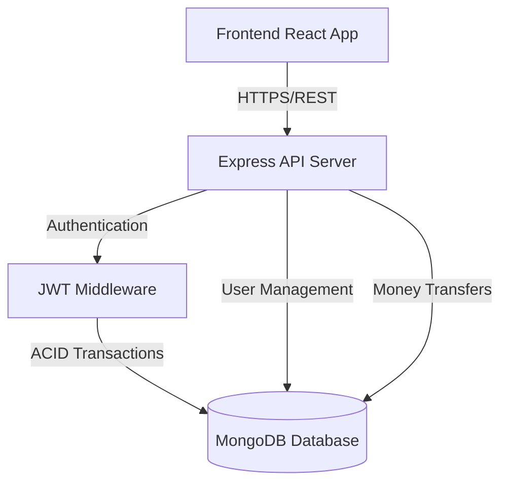

# <p align="center">💳 QuickPay - Digital Payment Platform</p>

<p align="center">
  
</p>

<p align="center">
  
  
  
  
  
  
</p>

---

## 🌟 Overview

**QuickPay** is a state-of-the-art digital payment solution designed for speed, security, and simplicity. Built with the **MERN stack**, it provides a seamless experience for users to manage their balance and perform instant peer-to-peer transfers. Whether you're sending money to a friend or tracking your transactions, QuickPay offers a professional-grade interface with rock-solid reliability.

> [!IMPORTANT]
> **QuickPay Live Demo:** [https://quick-pay-lac.vercel.app/](https://quick-pay-lac.vercel.app/)

---

## ✨ Key Features

- 🔐 **Secure Shield** - Advanced JWT-based authentication with bcrypt password hashing and Zod validation.
- 💸 **Lightning Transfers** - Real-time money transfers utilizing MongoDB ACID transactions to ensure data integrity.
- 🔍 **Smart Search** - Intelligently find users using advanced regex-based search functionality.
- 🎨 **Glassmorphism UI** - A breath-taking user interface built with Tailwind CSS, featuring smooth animations and a premium look.
- 📱 **Always Responsive** - Whether on a 4K monitor or a mobile device, QuickPay adapts perfectly to your screen.
- ⚡ **Atomic Updates** - Instant, real-time balance updates after every transaction without refreshing.

---

## 🏗️ System Architecture



---

## 💾 Database Schema

QuickPay utilizes a well-structured NoSQL schema to handle complex financial relationships.

### `User` Model
| Field | Type | Description |
| :--- | :--- | :--- |
| `username` | String | Unique email address (min 3, max 30 chars) |
| `password` | String | Hashed password (min 6 chars) |
| `firstName` | String | User's first name |
| `lastName` | String | User's last name |

### `Account` Model
| Field | Type | Description |
| :--- | :--- | :--- |
| `userId` | ObjectId | Reference to the User model |
| `balance` | Number | User's current balance (Decimal precision) |

---

## 🔌 API Reference

### Authentication
- `POST /api/v1/user/signup` - Register a new user and receive initial balance.
- `POST /api/v1/user/signin` - Authenticate and receive a JWT token.

### User Management
- `GET /api/v1/user/info` - Retrieve profile and current balance.
- `GET /api/v1/user/bulk` - Search for users by name.
- `PUT /api/v1/user/` - Update user profile information.

### Financials
- `GET /api/v1/account/balance` - Get current wallet balance.
- `POST /api/v1/account/transfer` - Perform a secure money transfer.

---

## 🚀 Getting Started

### 📝 Prerequisites
- [Node.js](https://nodejs.org/) (v18 or higher)
- [MongoDB Atlas](https://www.mongodb.com/cloud/atlas) Account
- Package Manager: `npm` or `yarn`

### 🛠️ Local Setup

1. **Clone the Project**
   ```bash
   git clone https://github.com/chitranshuajmera0000/QuickPay.git
   cd QuickPay
   ```

2. **Backend Configuration**
   ```bash
   cd backend
   npm install
   # Create a .env file based on .env.example
   npm start
   ```

3. **Frontend Configuration**
   ```bash
   cd ../frontend
   npm install
   # Configure VITE_API_URL in .env
   npm run dev
   ```

---

## 👨‍💻 Author

**Chitranshu Ajmera**
- GitHub: [@chitranshuajmera0000](https://github.com/chitranshuajmera0000)
- Portfolio: [Coming Soon]

---

<p align="center">
  Give it a ⭐ if you liked this project!
</p>
